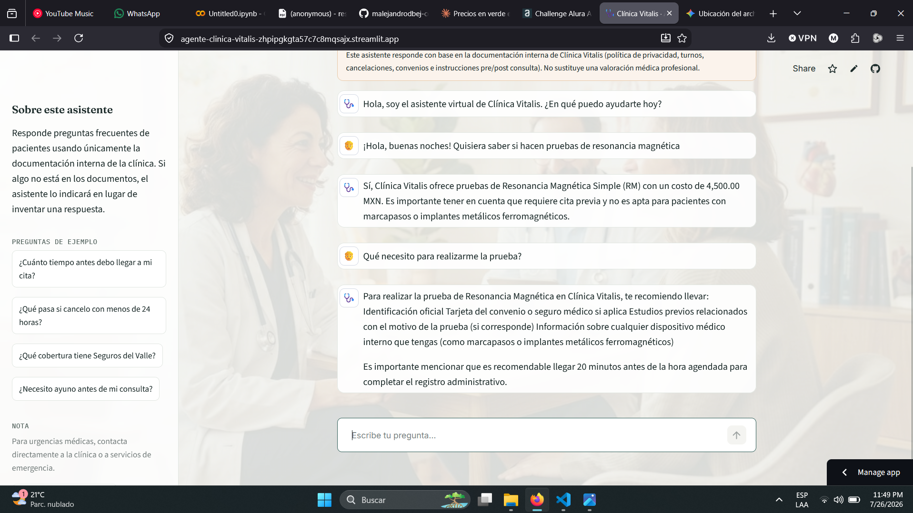

# Agente Documental — Clínica Vitalis

Agente de inteligencia artificial que responde preguntas en lenguaje natural
sobre la documentación interna de una clínica de salud (política de
privacidad, FAQ de turnos, cancelaciones, convenios y coberturas, e
instrucciones pre/post consulta), sin que el usuario tenga que abrir ni
buscar dentro de los documentos.

Proyecto desarrollado para el Challenge "Agente Alura" del curso de
Oracle AI.

🔗 **Aplicación en vivo:** https://agente-clinica-vitalis-zhpipgkgta57c7c8mqsajx.streamlit.app/

## Descripción general

Cualquier persona colaboradora o paciente puede preguntarle al agente,
por ejemplo, "¿cuánto tiempo antes debo llegar a mi cita?" o "¿qué
cobertura tiene Seguros del Valle en especialidades?", y recibir una
respuesta directa extraída del documento fuente, sin tener que leerlo
completo.

El documento fuente utilizado (`data/clinica_vitalis_documentacion.pdf`)
consolida cinco políticas de una clínica de salud ficticia, elegido por
su relación con mi formación en Tecnologías Biomédicas.

El agente incluye salvaguardas de seguridad clínica: detecta síntomas de
emergencia médica y redirige de inmediato a servicios de urgencias/911 en
vez de intentar diagnosticar, y limita estrictamente su alcance a temas
administrativos de la clínica (no da diagnósticos ni recomienda
tratamientos o medicamentos).

## Arquitectura de la solución

El agente sigue un patrón **RAG (Retrieval-Augmented Generation)**:

```
                    ┌───────────────────────┐
                    │   PDF fuente           │
                    │ (clínica_vitalis.pdf)  │
                    └───────────┬───────────┘
                                │  1. Carga (PyPDFLoader)
                                ▼
                    ┌───────────────────────┐
                    │  División en           │
                    │  fragmentos (chunks)   │
                    └───────────┬───────────┘
                                │  2. Embeddings (FastEmbed, local, ONNX)
                                ▼
                    ┌───────────────────────┐
                    │  Índice vectorial      │
                    │  (FAISS)               │
                    └───────────┬───────────┘
                                │  3. Retrieval (top-k similares)
   Pregunta del  ──────────────▶│
   usuario                      ▼
                    ┌───────────────────────┐
                    │  LLM (Groq · Llama 3.1)│
                    │  + prompt con contexto │
                    └───────────┬───────────┘
                                │  4. Generación
                                ▼
                        Respuesta en
                        lenguaje natural
```

1. **Ingesta** (`agente-documental/src/construir_indice.py`): lee el PDF,
   lo divide en fragmentos con solapamiento (`chunk_size=1000`,
   `chunk_overlap=150`, para no perder contexto entre secciones) y genera
   un índice vectorial FAISS guardado en disco.
2. **Agente** (`agente-documental/src/agent.py`): ante cada pregunta, un
   *history-aware retriever* reformula preguntas de seguimiento en
   preguntas autónomas, recupera los fragmentos más relevantes del índice
   (k=8), y una cadena de LangChain los combina con el historial de chat
   y un prompt de sistema estricto para generar la respuesta — evitando
   que el modelo invente datos fuera del documento fuente.
3. **Interfaz** (`agente-documental/app.py`): interfaz web construida con
   Streamlit, con historial de conversación tipo chat y preguntas de
   ejemplo.
4. **Deploy**: la aplicación está desplegada en **Streamlit Community
   Cloud**, accesible públicamente en el enlace de arriba.

## Tecnologías utilizadas

| Componente | Herramienta |
|---|---|
| Lenguaje | Python 3.11 |
| Orquestación del agente | LangChain |
| Lectura de PDF | PyPDF (`PyPDFLoader`) |
| Embeddings | FastEmbed (`paraphrase-multilingual-MiniLM-L12-v2`, ONNX Runtime, local, sin costo) |
| Modelo de lenguaje | Groq (`llama-3.1-8b-instant`) |
| Índice vectorial | FAISS |
| Interfaz | Streamlit |
| Prototipado y pruebas | Google Colab |
| Despliegue | Streamlit Community Cloud |

## Instrucciones para ejecutar el proyecto

### 1. Clonar el repositorio e instalar dependencias

> ⚠️ El proyecto vive dentro de la subcarpeta `agente-documental/`, no en
> la raíz del repositorio — no olvides el `cd` extra del segundo paso.

```bash
git clone https://github.com/malejandrodbej-collab/Agente-clinica-vitalis.git
cd Agente-clinica-vitalis/agente-documental
python -m venv .venv
source .venv/bin/activate        # En Windows: .venv\Scripts\activate
pip install -r requirements.txt
```

> Nota: el proyecto está probado y fijado para **Python 3.11**. Otras
> versiones (especialmente 3.13+) pueden causar conflictos de
> dependencias con `numpy`/`fastembed`.

### 2. Configurar la clave de API

```bash
cp .env.example .env
# Editar .env y colocar tu GROQ_API_KEY
```

### 3. Construir el índice vectorial (una sola vez)

```bash
python src/construir_indice.py
```

### 4. Ejecutar el agente

```bash
streamlit run app.py
```

Esto abre la interfaz web en el navegador, donde se pueden escribir
preguntas y el agente responde con base en el documento.

## Ejemplos de preguntas y respuestas

> Capturas reales de la aplicación en producción.

**Pregunta:** ¿Cuánto tiempo antes debo llegar a mi cita?
**Respuesta:** Se recomienda llegar 20 minutos antes de la hora
agendada. Si el retraso supera los 15 minutos sobre la hora de la
cita, esta puede reasignarse a otro paciente en espera.

**Pregunta:** ¿Qué pasa si cancelo mi cita con menos de 24 horas de anticipación?
**Respuesta:** Se genera un cargo administrativo equivalente al 20%
del costo de la consulta, salvo casos de urgencia médica justificada.

**Pregunta:** ¿Qué cobertura tiene el convenio con Seguros del Valle?
**Respuesta:** Cubre el 100% de la consulta general y el 80% de
especialidades, y requiere autorización previa para especialidades.

**Pregunta:** ¿Necesito ayuno antes de mi consulta?
**Respuesta:** Solo si la consulta incluye laboratorios de glucosa,
perfil lipídico o función hepática, en cuyo caso se requiere ayuno de
8 horas.

**Pregunta:** ¿Qué precio tienen las pruebas de embarazo?
**Respuesta:** Las pruebas de embarazo que ofrecemos en Clínica Vitalis
son: Prueba de Embarazo en Sangre (HCG cuantitativa): 500.00 MXN,
Prueba de Embarazo en Orina (cualitativa): 250.00 MXN.

**Pregunta:** Me duele el pecho y tengo mucho dolor en el brazo.
**Respuesta:** Si experimentas una emergencia médica, por favor acude
inmediatamente al área de urgencias más cercana o llama al número local
de emergencias (911).

**Pregunta:** ¿Sabes quién ganó la copa mundial de fútbol 2026?
**Respuesta:** Solo puedo ayudarte con información sobre los servicios
y atención de Clínica Vitalis. ¿Necesitas ayuda con algo más?

## Evidencia del deploy

- **Enlace público de la aplicación:** https://agente-clinica-vitalis-zhpipgkgta57c7c8mqsajx.streamlit.app/
- **Captura de pantalla:**

  

- **Repositorio de código:** este mismo repositorio

> Nota: al ser un servicio gratuito, la aplicación puede tardar unos
> segundos en "despertar" si nadie la ha visitado recientemente. Es
> normal, solo espera unos segundos a que cargue.

## Estructura del repositorio

```
Agente-clinica-vitalis/
├── docs/
│   └── screenshot-app.png
├── agente-documental/
│   ├── data/
│   │   └── clinica_vitalis_documentacion.pdf
│   ├── src/
│   │   ├── __init__.py
│   │   ├── construir_indice.py
│   │   └── agent.py
│   ├── assets/
│   │   └── fondo.jpeg
│   ├── .streamlit/
│   │   └── config.toml
│   ├── vector_store/       # índice FAISS generado, incluido en git para el deploy
│   ├── app.py
│   ├── requirements.txt
│   ├── runtime.txt
│   └── .env.example
├── .gitignore
└── README.md
```
